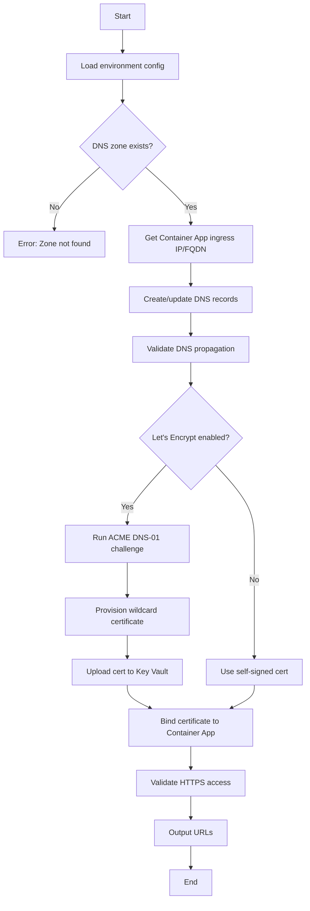

# DNS Configuration Requirements

**Feature**: 001-azure-deployment-test  
**Phase**: 7 - DNS Configuration (Priority P1)  
**Date**: 2025-11-28  
**Status**: Ready for Implementation

---

## Domain Configuration

### Primary Domain
- **Domain**: `ormasoft.cl`
- **Provider**: Azure DNS (already managed in Azure subscription)
- **Zone Type**: Public DNS Zone
- **Status**: ✅ Existing, Azure-managed

### Tunnel Subdomain Structure

```
ormasoft.cl (existing zone)
└── tunnel.ormasoft.cl (tunnel services)
    ├── tunnel.ormasoft.cl → Container App Ingress (Management API)
    ├── *.tunnel.ormasoft.cl → Container App Ingress (individual tunnels)
    │
    └── test.tunnel.ormasoft.cl (test environment)
        ├── test.tunnel.ormasoft.cl → Test Container App
        └── *.test.tunnel.ormasoft.cl → Test Container App
```

### Environment-Specific Domains

| Environment | Management API | Tunnel Pattern | Example Tunnel |
|-------------|---------------|----------------|----------------|
| Test | `test.tunnel.ormasoft.cl` | `*.test.tunnel.ormasoft.cl` | `my-api.test.tunnel.ormasoft.cl` |
| Production | `tunnel.ormasoft.cl` | `*.tunnel.ormasoft.cl` | `my-api.tunnel.ormasoft.cl` |

---

## DNS Records Configuration

### Test Environment Records

```bash
# Azure DNS Zone: ormasoft.cl
# Records to create:

# Root record for test Management API
A    test.tunnel.ormasoft.cl              300   <CONTAINER_APP_IP>

# Wildcard for test tunnels
A    *.test.tunnel.ormasoft.cl            300   <CONTAINER_APP_IP>
# OR
CNAME *.test.tunnel.ormasoft.cl           300   <CONTAINER_APP_FQDN>
```

### Production Environment Records

```bash
# Azure DNS Zone: ormasoft.cl
# Records to create:

# Root record for production Management API
A    tunnel.ormasoft.cl                   300   <CONTAINER_APP_IP>

# Wildcard for production tunnels
A    *.tunnel.ormasoft.cl                 300   <CONTAINER_APP_IP>
# OR
CNAME *.tunnel.ormasoft.cl                300   <CONTAINER_APP_FQDN>
```

### Record Type Decision

**Use A Records if**:
- Container Apps has static ingress IP (dedicated environment)
- Faster DNS resolution required
- Direct IP routing preferred

**Use CNAME Records if**:
- Container Apps uses dynamic FQDN (consumption plan)
- Azure manages IP changes automatically
- Easier maintenance

**Recommendation**: Use **A records** for production (dedicated environment), **CNAME** for test (consumption)

---

## TLS Certificate Strategy

### Certificate Provider: Let's Encrypt

**Why Let's Encrypt**:
- ✅ Free, automatic, trusted by all browsers
- ✅ Supports wildcard certificates
- ✅ 90-day auto-renewal
- ✅ ACME protocol integration
- ✅ No manual CSR/certificate management

### Certificate Configuration

| Environment | Certificate CN | SAN (Subject Alternative Names) | Challenge Type |
|-------------|---------------|--------------------------------|----------------|
| Test | `*.test.tunnel.ormasoft.cl` | `test.tunnel.ormasoft.cl` | DNS-01 |
| Production | `*.tunnel.ormasoft.cl` | `tunnel.ormasoft.cl` | DNS-01 |

### ACME DNS-01 Challenge

**Why DNS-01**:
- Required for wildcard certificates (`*.tunnel.ormasoft.cl`)
- Works with Azure DNS Zone API
- No HTTP endpoint required during provisioning

**How it works**:
1. ACME client (certbot/acme.sh) requests certificate from Let's Encrypt
2. Let's Encrypt challenges: "Prove you own `tunnel.ormasoft.cl`"
3. Script creates TXT record: `_acme-challenge.tunnel.ormasoft.cl`
4. Let's Encrypt verifies TXT record
5. Certificate issued (valid 90 days)
6. Auto-renewal 30 days before expiry

### Certificate Storage

- **Location**: Azure Key Vault (existing from Phase 4)
- **Secret Names**:
  - Test: `tls-cert-test`, `tls-key-test`
  - Production: `tls-cert-prod`, `tls-key-prod`
- **Format**: PEM-encoded certificate + private key
- **Access**: Container App managed identity (already configured)

---

## Azure Resources Required

### Existing Resources (from Phases 1-6)
- ✅ Azure DNS Zone: `ormasoft.cl`
- ✅ Azure Key Vault: `protogate-kv-<unique-suffix>`
- ✅ Container Apps Environment: `protogate-env-test`
- ✅ Container App: `protogate-server-test`
- ✅ Managed Identity: `protogate-server-test-identity`

### New Resources (Phase 7)
- DNS Records (A/CNAME) under `ormasoft.cl` zone
- Let's Encrypt wildcard certificates
- Container Apps custom domain bindings
- Certificate bindings on Container App ingress

### Required Permissions

The deployment principal (your Azure CLI user or service principal) needs:

```json
{
  "roles": [
    "DNS Zone Contributor",        // Create DNS records in ormasoft.cl
    "Key Vault Secrets Officer",   // Store certificates in Key Vault
    "Container Apps Contributor"   // Configure custom domains on apps
  ],
  "scope": "/subscriptions/{subscription-id}/resourceGroups/{rg-name}"
}
```

---

## Implementation Script

### Script: `scripts/configure-dns.sh`

**Purpose**: Configure DNS records, provision Let's Encrypt certificates, bind to Container App

**Usage**:
```bash
# Test environment
./scripts/configure-dns.sh \
  --env test \
  --zone ormasoft.cl \
  --subdomain tunnel \
  --letsencrypt \
  --email admin@ormasoft.cl

# Production environment
./scripts/configure-dns.sh \
  --env prod \
  --zone ormasoft.cl \
  --subdomain tunnel \
  --letsencrypt \
  --email admin@ormasoft.cl
```

**Arguments**:
- `--env`: Environment (test/prod)
- `--zone`: Base DNS zone (ormasoft.cl)
- `--subdomain`: Tunnel subdomain (tunnel)
- `--letsencrypt`: Enable Let's Encrypt provisioning
- `--email`: Contact email for Let's Encrypt notifications

### Script Flow



### Key Functions

1. **validate_dns_zone()**: Verify `ormasoft.cl` zone exists in subscription
2. **get_container_app_ingress()**: Fetch ingress IP/FQDN from Container App
3. **create_dns_records()**: Create A/CNAME records for root + wildcard
4. **validate_dns_propagation()**: Poll DNS until records resolve (max 10 min)
5. **provision_letsencrypt_cert()**: Run ACME DNS-01 challenge
6. **upload_cert_to_keyvault()**: Store certificate in Key Vault
7. **bind_custom_domain()**: Configure Container App custom domain
8. **validate_https()**: Test HTTPS endpoint with curl

---

## Prerequisites Checklist

Before running Phase 7, verify:

- [ ] **Azure DNS Zone**: `ormasoft.cl` exists and accessible
- [ ] **Container App Running**: Test environment deployed (Phase 5 complete)
- [ ] **Key Vault Provisioned**: From Phase 4, managed identity has access
- [ ] **ACME Client Installed**: `certbot` or `acme.sh` available on system
- [ ] **Azure CLI Authenticated**: `az account show` returns correct subscription
- [ ] **Permissions Verified**: User has DNS/KeyVault/ContainerApps contributor roles
- [ ] **Email Contact**: Valid email for Let's Encrypt expiry notifications

---

## Validation & Testing

### DNS Resolution Tests

```bash
# Test environment
dig @8.8.8.8 test.tunnel.ormasoft.cl
# Expected: A record resolving to container app IP

dig @8.8.8.8 my-api.test.tunnel.ormasoft.cl
# Expected: A record (or CNAME) resolving to container app

# Verify propagation globally
dig @1.1.1.1 test.tunnel.ormasoft.cl        # Cloudflare DNS
dig @208.67.222.222 test.tunnel.ormasoft.cl # OpenDNS
```

### Certificate Validation

```bash
# Check certificate details
curl -vI https://test.tunnel.ormasoft.cl 2>&1 | grep -E 'subject|issuer|expire'
# Expected:
# - Issuer: Let's Encrypt Authority X3
# - Subject: CN=*.test.tunnel.ormasoft.cl
# - Expire date: 90 days from now

# Verify wildcard works
curl -I https://my-api.test.tunnel.ormasoft.cl
# Expected: Valid certificate (no warnings)

# Test in browser
open https://test.tunnel.ormasoft.cl
# Expected: Green padlock, no certificate warnings
```

### HTTPS Access Test

```bash
# Create test tunnel
curl -X POST https://test.tunnel.ormasoft.cl/v1/tunnels \
  -H "Content-Type: application/json" \
  -d '{"tunnel_id":"test-api","protocol":"HTTP","local_url":"http://localhost:3000"}'

# Access tunnel endpoint
curl https://test-api.test.tunnel.ormasoft.cl/
# Expected: Proxied response from local service (or 503 if agent not connected)
```

---

## Success Criteria

Phase 7 is **COMPLETE** when:

- ✅ DNS records created in `ormasoft.cl` zone
- ✅ `test.tunnel.ormasoft.cl` resolves to test container app
- ✅ `*.test.tunnel.ormasoft.cl` resolves to test container app
- ✅ Let's Encrypt wildcard certificate provisioned
- ✅ Certificate uploaded to Key Vault
- ✅ Custom domain configured on Container App
- ✅ HTTPS access works with valid certificate (no browser warnings)
- ✅ Wildcard subdomain routing works (`{tunnel-id}.test.tunnel.ormasoft.cl`)
- ✅ Management API accessible at `https://test.tunnel.ormasoft.cl/v1/tunnels`

---

## Production Deployment Notes

### Differences from Test

1. **No `-test` suffix**: Use `tunnel.ormasoft.cl` instead of `test.tunnel.ormasoft.cl`
2. **Dedicated environment**: Production should use dedicated Container Apps environment (not consumption)
3. **Separate certificates**: Production gets its own Let's Encrypt cert
4. **Monitoring**: Enable Application Insights and alerts (Phase 8)

### Production Checklist

- [ ] Review test environment configuration
- [ ] Update environment variables: `--env prod`
- [ ] Verify dedicated Container Apps plan provisioned
- [ ] Run `configure-dns.sh --env prod --letsencrypt`
- [ ] Update external DNS if needed (nameserver delegation)
- [ ] Test production endpoints
- [ ] Configure monitoring and alerts
- [ ] Document production URLs in runbook

---

## Troubleshooting

### DNS Not Resolving

```bash
# Check if records exist
az network dns record-set a show \
  --resource-group <rg> \
  --zone-name ormasoft.cl \
  --name test.tunnel

# Verify TTL and propagation time (default 300s = 5 min)
# Wait up to 10 minutes for global propagation
```

### Let's Encrypt Provisioning Failed

```bash
# Check ACME logs
certbot certificates

# Verify DNS zone API access
az network dns zone show --resource-group <rg> --name ormasoft.cl

# Manual DNS-01 challenge test
# (Script should create _acme-challenge TXT record temporarily)
```

### Certificate Not Trusted

```bash
# Verify certificate chain
curl https://test.tunnel.ormasoft.cl --cacert /etc/ssl/certs/ca-certificates.crt

# Check if Let's Encrypt root CA is trusted
openssl s_client -connect test.tunnel.ormasoft.cl:443 -showcerts
```

### Custom Domain Binding Failed

```bash
# Check Container App ingress configuration
az containerapp show --name protogate-server-test --resource-group <rg> \
  --query "properties.configuration.ingress.customDomains"

# Verify certificate is in Key Vault
az keyvault secret show --vault-name <kv-name> --name tls-cert-test
```

---

## Next Steps After Phase 7

Once DNS is operational:

1. **Update Quickstart Guide**: Document new production URLs
2. **Phase 8 - Monitoring**: Configure Application Insights for DNS endpoints
3. **Phase 9 - Production Deployment**: Deploy to `tunnel.ormasoft.cl`
4. **External Documentation**: Update external docs with production URLs
5. **Certificate Renewal**: Set up monitoring for certificate expiry (30 days warning)

---

## References

- [Azure DNS Documentation](https://learn.microsoft.com/azure/dns/)
- [Let's Encrypt DNS-01 Challenge](https://letsencrypt.org/docs/challenge-types/#dns-01-challenge)
- [Container Apps Custom Domains](https://learn.microsoft.com/azure/container-apps/custom-domains-certificates)
- [ACME Protocol RFC 8555](https://tools.ietf.org/html/rfc8555)
